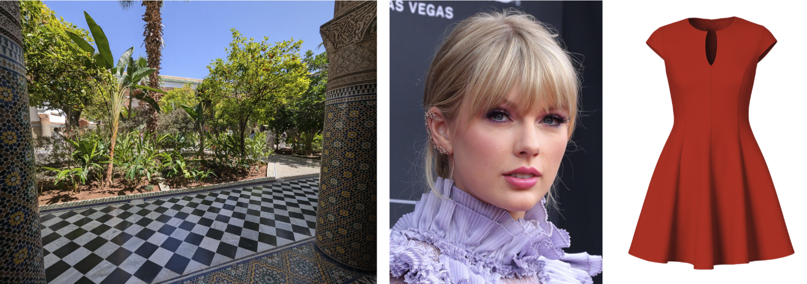
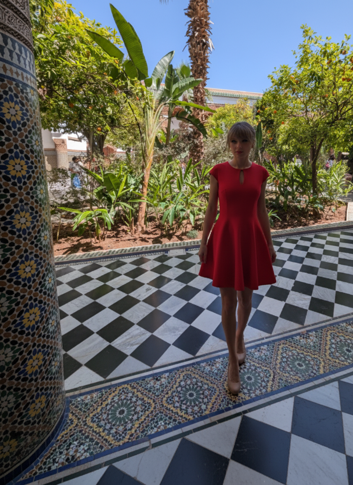
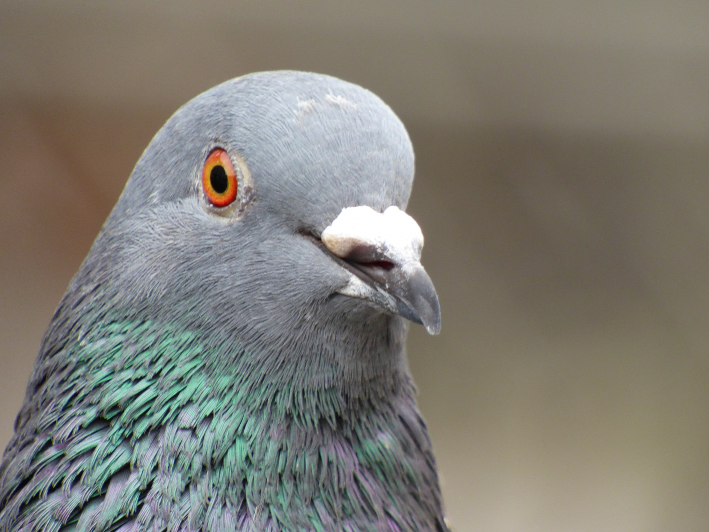
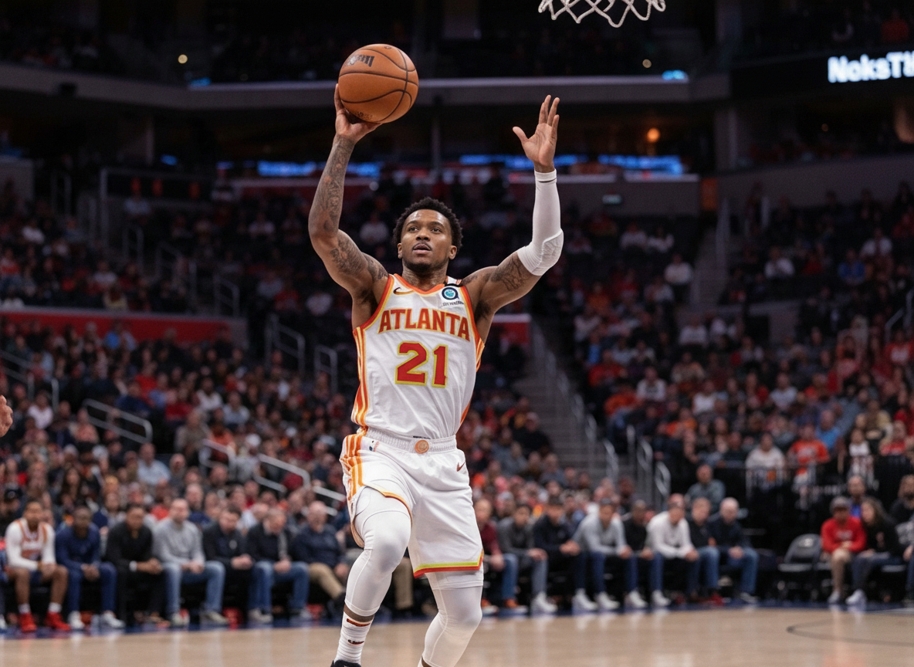
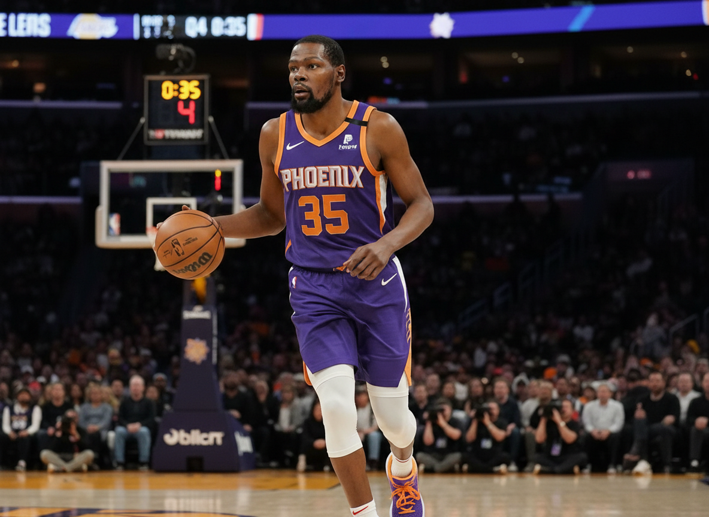
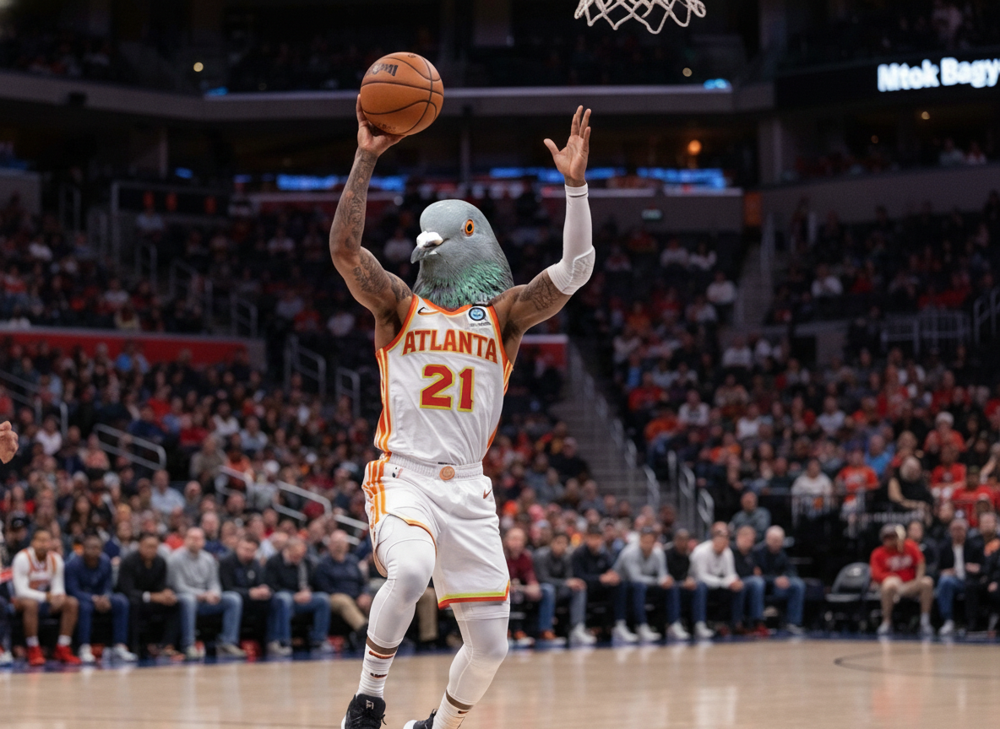
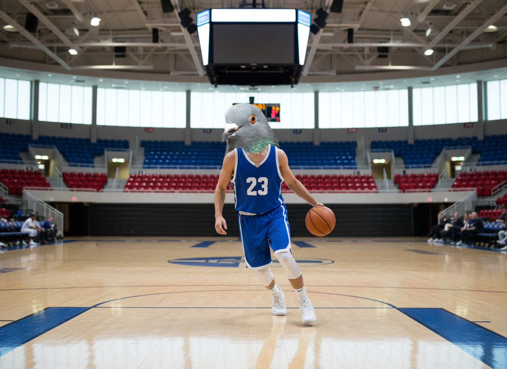
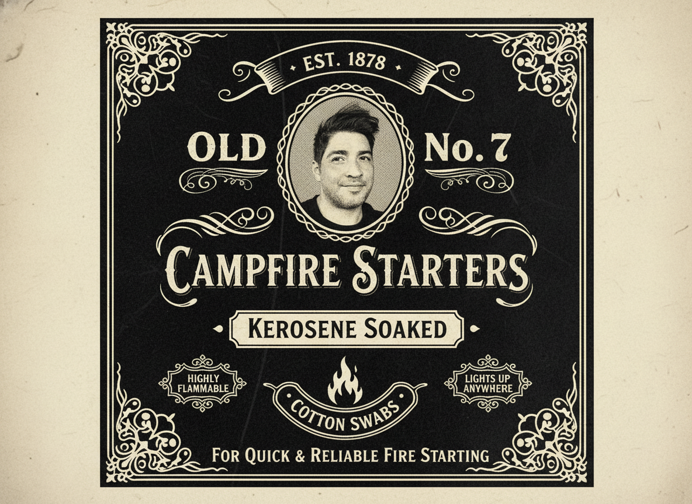
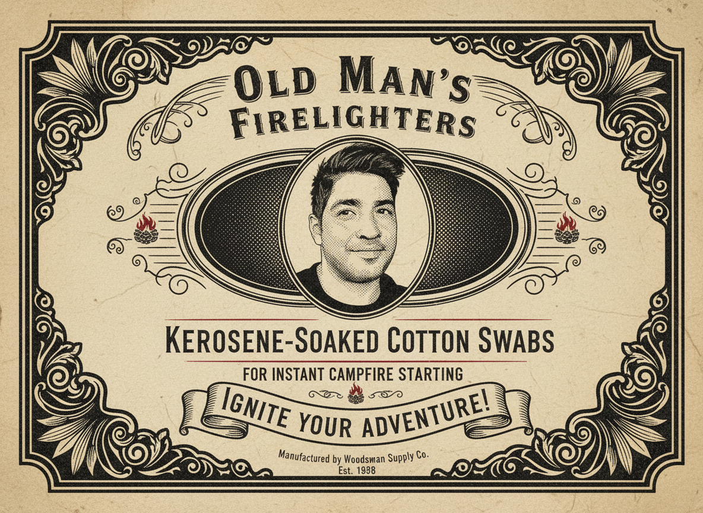

<link rel="stylesheet" href="../../../../style.css">

# Combine Images with Gemini Banana

## 
## Taytay

This [article from Guillaume Laforge on Banana](https://glaforge.dev/posts/2025/09/09/calling-nano-banana-from-java/), show how to create images with a text prompt and combining images.

Below are the results when I ran the code unchanged.

## Next Pigeon

Most members of my family are San Antonio Spurs fans.  My tio has a saying when 
they win; 'next pigeon'.

So I wrote some prompts/code to look up the next opponent and popular player on that team.

Then it replaces the Spurs next opponent’s main player’s head with a pigeon’s head.

But this prompt gave a failure message
    
// The next comment prompt gave a message about not being able to look up future
// events        
//        var promptText = """
//                Given todays date and the 2025 NBA schedule, what team do the 
//                San Antonio Spurs play next.  Provide just the city name and 
//                mascot name.
//                                """;

//nope - it gave the wrong team
//        var promptText = """
//                what team do the 
//                San Antonio Spurs play next.  Provide just the city name and 
//                mascot name.
//                                """;

------------------------------------------------------

Pigeon Head

    https://www.publicdomainpictures.net/en/view-image.php?image=82045&picture=head-pigeon

Other Pigeon Head Photos

    https://www.gettyimages.com/photos/pigeon-head

## Bottle Label

TODO: blurb

