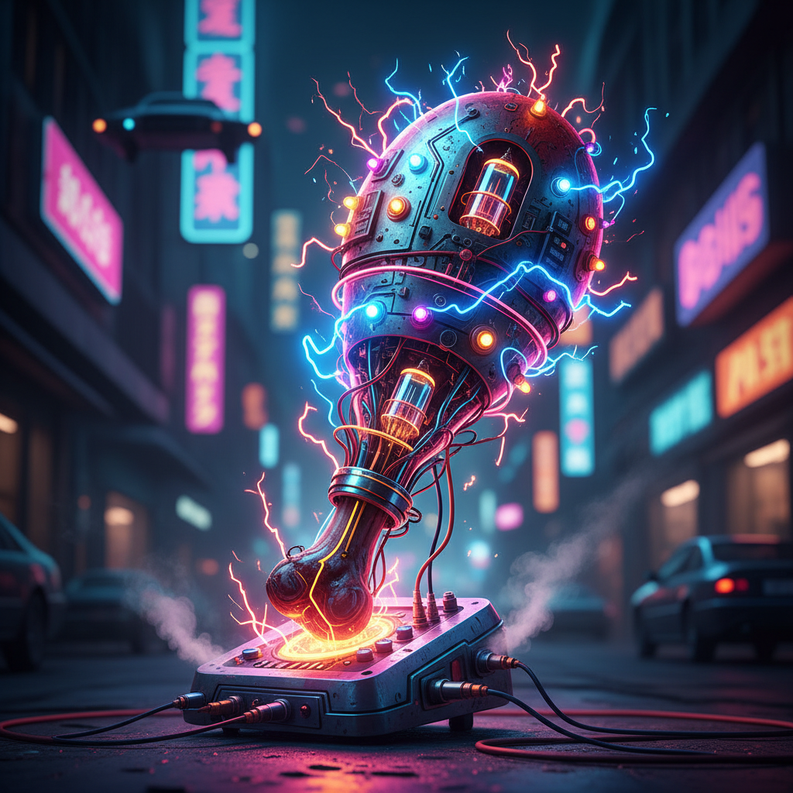
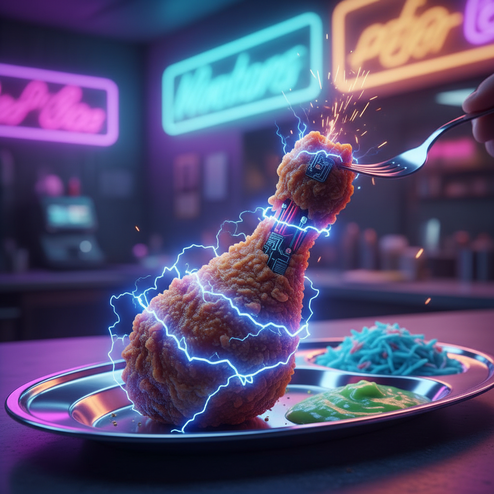
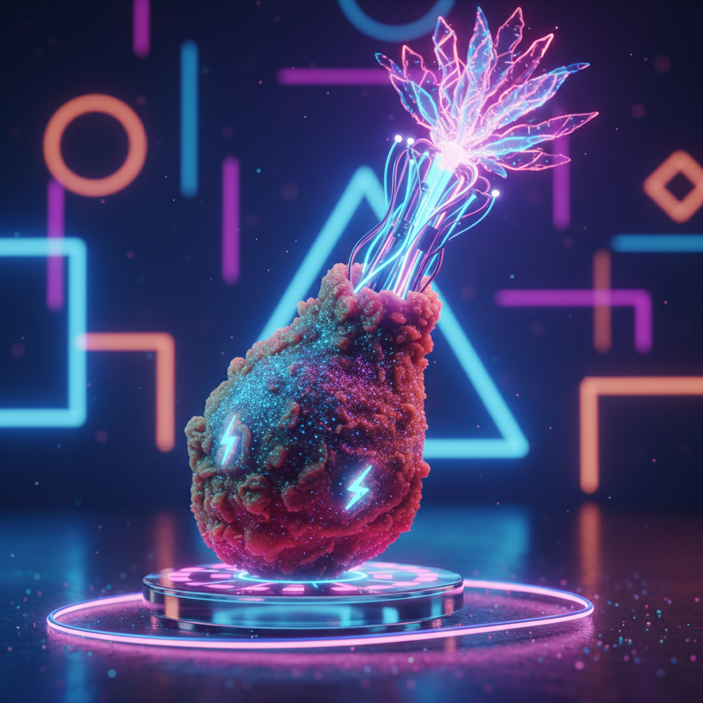
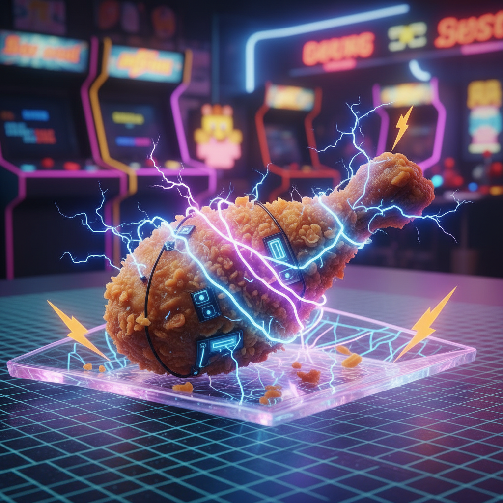
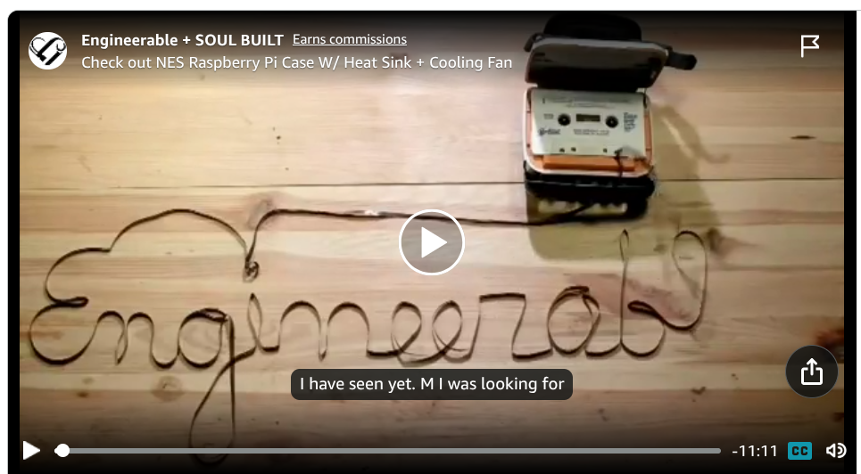
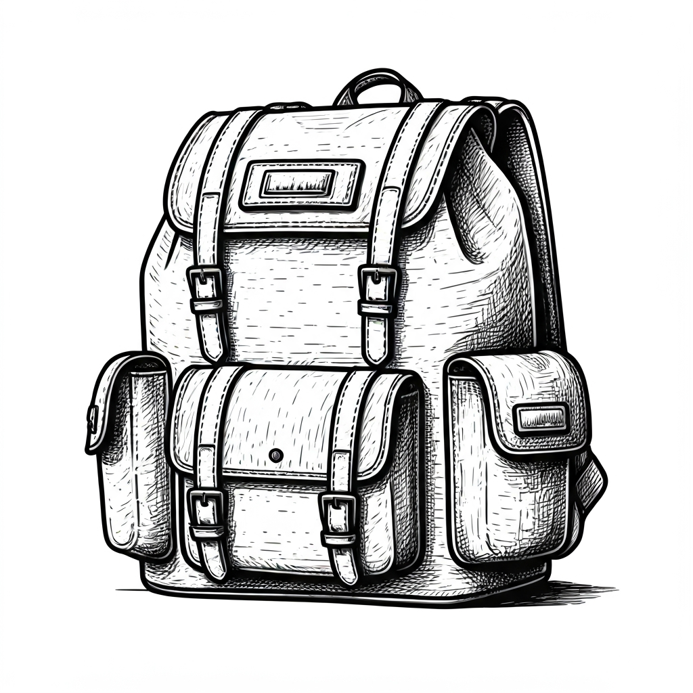

# Create Images with Gemini Banana 

## [Funky Electric Chicken Leg](#funky-chicken)

Around the time I was experimenting with Google Gemini with Java, I had a dream where a relative told me to to eat something or I would get the 'electric funky chicken leg'.  Woke up before I could ask what that meant.  So I asked Gemini Banana to create images with that as the prompt.

Here are some samples:

## Album Cover

TODO: ploop

## Cassette Tape Text

I got the idea for the tape to text from this video

https://youtu.be/PfIuQK2Lfwg?t=8

Todo: link to code

[From this image, a video was made](../../videos/create/readme.md).

## InkTober - Using LangChain4J

LangChain4J is design to work with Large Language Models in programmatic way.

# Inktober

Todo: link to code

TODO: embed the images

Imagen 3 (uses Vertex AI; not free)

The code for this articel can make ink drawings.

https://glaforge.dev/posts/2024/10/01/ai-nktober-generating-ink-drawings-with-imagen/

Ink Images for Inktober 2025

Setup
~/Workspace/owner/artificial-intellegence/large-language-models/LangChain4j/Inktober

export GCP_PROJECT_ID=$GOOGLE_CLOUD_PROJECT_ID
export GCP_VERTEXAI_ENDPOINT=us-central1-aiplatform.googleapis.com:443
export GCP_LOCATION=us-central1

I tried this in settings.json but gave an error for the Gemini Imagen example
,
     "args": [       
       "--output_directory", "target/"
     ]

# How Silly can you get????????

TODO: blerb

## [Up](../readme.md)
