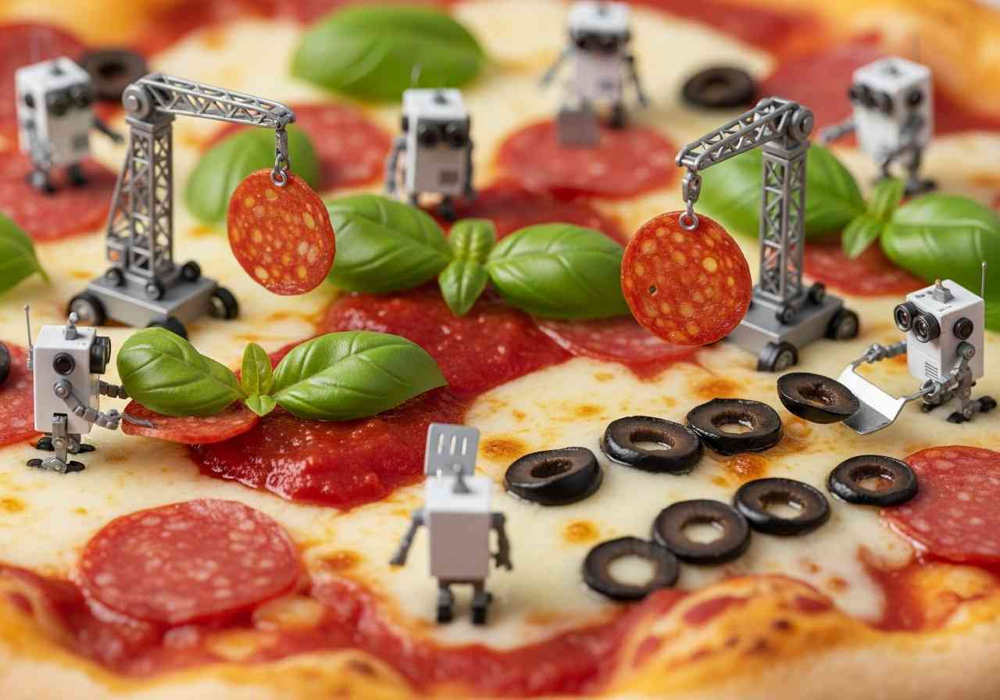

# Google Gemini Browser-Based Agents - Video/Animations

The section has some videos that were generated with the 
 [RoboPizza.IMAGE](../../gemini/programmatic/images/prompts/src/main/java/org/onebeartoe/prompts/Prompts.java) and RoboPizza.ANIMATION prompts.

## Images

## Animations/Video

Be sure to see the videos in this section.  I could not find a way to embed them, but they are some in this directory.

<video controls src="download_new.mp4">

<video controls src="download-3_new.mp4">

## [Up](../readme.md)
